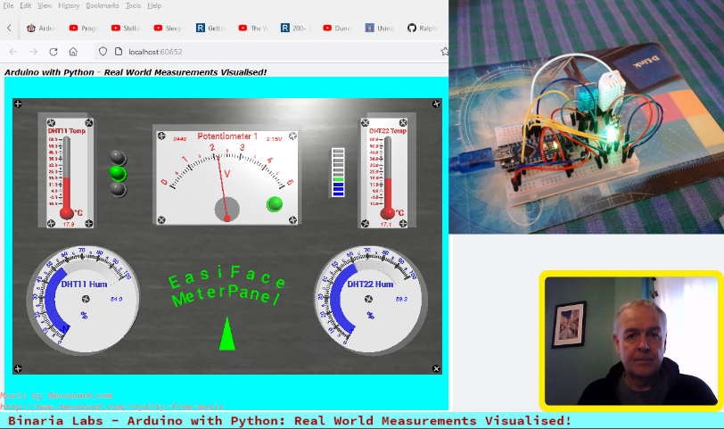

# TTB-AP-Lesson11
My Solution to Paul McWhorter's "Arduino with Python: LESSON 11" homework.

Visit Paul's video here:
 - https://youtu.be/watch?v=VdSFwYrYqW0

You can get Paul's code here:
 - https://toptechboy.com/

You can see my solution demonstrated here:
 - https://youtu.be/WycC-oL0vR8

My Arduino sketch uses some simple multitasking with "millis()" to send and receive structured and CRC8 checked, data to/from Python. I now also have a watchdog monitoring the Arduino code.

## My EasiFace Meter Panel - All OK:

